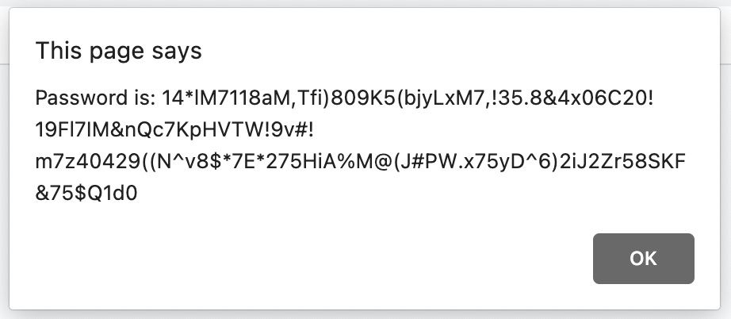
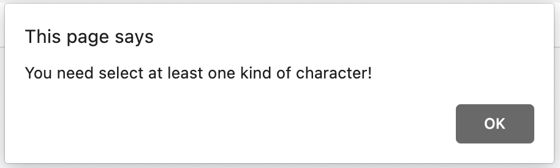

# BC-Javascript-Password-Generator

This site is a includes a simple random password generator that can give a customized result with user-defined parameters.  Through javascript prompts, the user may choose a specific length password between 8 and 128 characters. Once the length is specified, the user may elect to include any combination of upper and lower case letters, numbers, and special characters.

USER STORY:
AS AN employee with access to sensitive data
I WANT to randomly generate a password that meets certain criteria
SO THAT I can create a strong password that provides greater security

---------
## Built With

* [HTML](https://developer.mozilla.org/en-US/docs/Web/HTML)
* [CSS](https://developer.mozilla.org/en-US/docs/Web/CSS)
* [Javascript](https://developer.mozilla.org/en-US/docs/Web/JavaScript)
* [Git](https://git-scm.com/)
* [GitHub](https://github.com/)

-----
## Code Snippets

**Initial Password Length Prompt:**
```js
var chooseLength = 0
function askUser() {
    chooseLength = prompt("How many characters would you like in your password? Choose from 8 to 128");
    if ((chooseLength < 8) || (chooseLength > 128)) {
        alert("please choose between 8 and 128 characters!")
        askUser();
    }
}                      
```

**Example of a Parameter Prompt Function**
```js
function askCase() {
    passTypes = [];
    // confirm if upper case letters should be included
    var useUpper = confirm("Would you like to include upper case letters?")
    if (useUpper === true) {
        passTypes.push(true)
    } else {
        passTypes.push(false)
    }
```

**Parametric Random Integer Function**
```js
function randomInteger(min, max) {
    return Math.floor(Math.random() * (max - min) + min);
```

**Main Logical Structure**
```js
if (passTypes[passTypeResult] === true) {

        //  below works to push, or populate the mainPassword character array
        if (passTypeResult === 0) {
            mainPassword.push(upperCase[randomInteger(0, upperCase.length)])
        } else if
            (passTypeResult === 1) {
            mainPassword.push(lowerCase[randomInteger(0, lowerCase.length)])
        } else if
            (passTypeResult === 2) {
            mainPassword.push(numerCase[randomInteger(0, numerCase.length)])
        } else {
            mainPassword.push(specCase[randomInteger(0, specCase.length)])
        }
```
---
### Deployed Link

* [See Live Site](https://rbrtpublic1.github.io/Responsive-design/)
---
### On GitHub

* [Repository Link](https://github.com/rbrtpublic1/Responsive-design)

---
## Screenshots:

### 128 character result with all cases selected

### If the user selects no character options



---
### Author: *Robert Schramm*
- [LinkedIn](https://www.linkedin.com/in/robertwschramm/)
- [Link to Github](https://github.com/rbrtpublic1)
---
### License
This project is licensed under the MIT License

---

### Acknowledgments

* Thank you to M.N. for the late-hour consultation!
